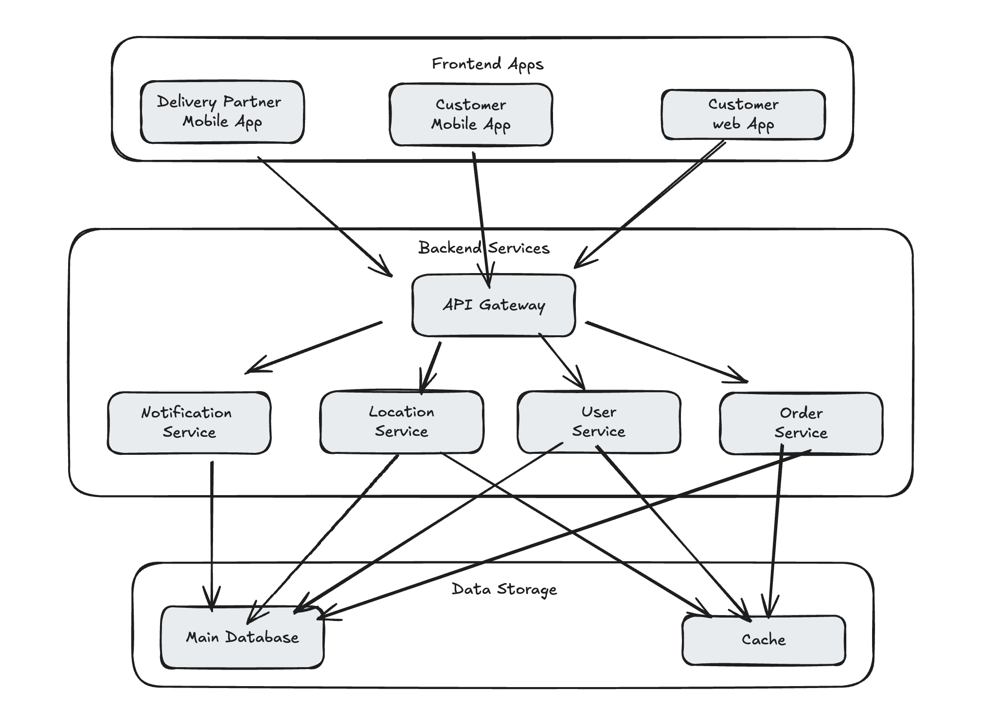

# Answers						

1. For the working prototype, I propose a system built with modular components that can operate independently. The core system consists of two mobile applications - one for customers and one for delivery partners - along with a customer-facing web application. These frontend applications will be supported by several backend services: an API gateway acting as the single entry point, and core services handling orders, user management, locations, and notifications. All services will use a PostgresSQL database for data persistence and Redis for caching. The API gateway will route requests to appropriate services, maintaining clean separation of concerns. This architecture allows for independent deployment of components while keeping the system maintainable and scalable. 

2. For the initial prototype, I would recommend implementing a modular monolith architecture rather than microservices. Factors such as our small team size, the need for rapid development and iterations, and resource efficiency with limited maintenance bandwidth make having a single monolith repository more appropriate. However, by implementing clear module boundaries and following domain-driven design principles, we can ensure that components can be easily separated into microservices if needed. 

3. I recommend implementing a hybrid agile methodology that combines elements of scrum and kanban. In my experience, a small team with changing project requirements works well with one- to two-week sprints while maintaining a kanban board with in-progress tasks. This would allow for structured delivery cycles while maintaining flexibility for rapid changes if needed. Albeit important, I believe we could minimize documentation in favor of developing software and maintaining quick decision-making cycles given that we’re working on a prototype and need to hold regular demos.

4. For version control, I propose implementing [GitHub flow](https://githubflow.github.io/) with some customizations for our team. This includes having the main branch always kept deployable, with changes coming through feature branches and pull requests. Every pull request must have at least one code review approval and should pass all automated tests before merging. Such a process ensures consistent testing and knowledge sharing within the team.  It would also be good practice to squash commits before merging and follow branch naming conventions. This workflow provides good quality control and development speed, while keeping the process simple enough for a small team. 

5. During the initial prototype phase, perhaps a QA engineer would ensure product quality and reliability. I would work as a backend developer, focusing on implementing core services and infrastructure while collaborating with the dev designer for frontend development. After the prototype demonstrates success, we should gradually expand the team with additional developers specializing in backend, frontend, and mobile development. We’ll also need a DevOps engineer to manage infrastructure and scaling, and a product owner for managing stakeholder requirements and defining product roadmap.

6. Additional considerations would include maintaining code quality through automated linting and CI/CD pipelines. We should also use Docker for containerized development to ensure consistency across the team, along with IaC for reliable deployments. Implementing monitoring platforms, such as Sentry for error tracking and DataDog for performance monitoring and log aggregation is also crucial for identifying and resolving issues in a timely manner. I also believe regular knowledge sharing sessions and having engineers under the same domain take on rotating tasks is crucial to avoid heavy dependence on a single engineer at any given time. Lastly, clear documentation practices are also greatly important to support maintenance and onboarding.

